# ERM Navigator — Design Directions

> Seven side-by-side design directions for an Enterprise Risk Management dashboard, rendered on a Figma-like canvas in the browser.

## What it does

This repo is a visual design exploration for the **ERM Navigator** product — a dashboard for tracking risk maturity across 10 ISO-31000-style pillars × 4 dimensions (People / Process / Technology / Governance). Seven directions (A through G, plus D-variants) each render the *same* underlying dataset so the comparison is apples-to-apples — only the visual language, hierarchy, and motion change between artboards.

Open `index.html` in a browser and the page lays out every direction inside a custom `DesignCanvas` wrapper that behaves like a Figma board: artboards are draggable/reorderable, labels are inline-editable, and any artboard can be popped into a fullscreen focus overlay (←/→/Esc to navigate). Canvas state persists to a `.design-canvas.state.json` sidecar.

There is no build step. React + Babel-standalone load from CDN; every `.jsx` file is transpiled in the browser.

## Tech stack

| Layer | Choice |
|---|---|
| Runtime | React 18.3.1 (UMD from unpkg) |
| Transpiler | `@babel/standalone` 7.29.0 (browser, JIT) |
| Type system | None at root; `src/` is a reference TS port |
| Charts | Hand-rolled SVG radar + recharts (in `src/`) |
| Motion | `framer-motion` (used in `src/`) |
| Typography | Fraunces / Inter / Inter Tight / JetBrains Mono via Google Fonts |
| Persistence | Sidecar JSON via host bridge |
| Build / bundler | Intentionally none |

## Architecture



`erm-shared.jsx` is the single source of truth: it exports `ERM_DATA` (10 pillars × scores / targets / regressions / 6-item roadmap), a `buildHeat()` helper that derives a deterministic pillar × dimension grid, and shared SVG math for the radar polygons. Each direction file consumes this and renders its own artboard. `design-canvas.jsx` is a self-contained Figma-like wrapper (~50KB JSX) that handles drag-reorder, inline rename, fullscreen, and persistence — no external deps, dc-prefixed CSS injected once.

## Notable techniques

- **Babel-standalone in production** (`index.html:20-34`) — every direction is `<script type="text/babel" src="…">`, transpiled in the browser. Tradeoff: zero build chain, but every change is a hard reload and you ship Babel to the viewer. Reasonable for a design-review canvas, not for shipped product.
- **Container-query-driven artboard chrome** (`design-canvas.jsx`) — the per-artboard label/grip/expand row uses `container-type: inline-size` with `@container (max-width: 110px)` rules so narrow artboards collapse the label and reveal the grip on hover only. Lets you pack tiny artboards next to wide ones without manual sizing logic.
- **Deterministic synthetic heat grid** (`erm-shared.jsx:49-60`) — `buildHeat()` derives each cell score from its pillar's score plus a deterministic drift function based on dimension index and the pillar id's char code. Same inputs → same grid every reload, so the directions stay visually comparable across sessions.
- **Single ERM_DATA payload** — all seven directions render the same numbers (overall 3.34, benchmark 3.55, three regressions, six-item roadmap). The comparison is purely visual, never confounded by different data.

## How to run

No install. No dev server. Just:

```bash
open index.html
# or
python3 -m http.server 8000   # then visit http://localhost:8000
```

The `src/` folder contains a reference TypeScript port (`App.tsx`, ~84KB) that pulls in `recharts`, `framer-motion`, `lucide-react`, and the shadcn-style primitives in `src/components/`. There is **no `package.json`** at the root — `src/` is a stash of the eventual production-grade port, not currently wired up.

## What I'd do differently today

- **Drop Babel-standalone**, add a Vite + React + TS scaffold around `src/` and finish the port. Browser-side Babel is fine for a one-off design canvas but it's the wrong default once the work outlives the review.
- **Hoist `ERM_DATA` to JSON** so the directions can also be consumed by tests, snapshot tools, or a Storybook. JS-module data tied to a `<script>` order makes refactoring fragile.
- **Replace inline `<style>` injection in `design-canvas.jsx`** with a CSS module or vanilla-extract. The dc-prefix pattern works but is hard to test and doesn't compose with theming.

## License

Unlicensed — internal design exploration.
